# Diagrams

## Pick the renderer first

- **Diagram ends up as an image** (Jira, Confluence, docs, artifacts, chat): D2 in sketch style with the ELK
  layout. Sebastian's preferred look. Render with `scripts/d2-render.sh in.d2 [out.svg|out.png]`, which
  validates first and defaults to `--sketch --layout elk`; the SVG embeds its fonts and works standalone.
- **Diagram must render inline from text** (GitLab or GitHub markdown, MR descriptions): Mermaid, since
  git.netresearch.de renders no other fence. Start from the theme block below; the default theme looks dated.

Either way, a diagram of a real system is built from that system (workflow definitions, DB, source), never
from framework defaults. A hand-written diagram looks convincing even when every edge is wrong.

## D2

- Syntax: containers `name: "Label" { ... }`, edges `a -> b: label`, shapes `{shape: cylinder}` (also `queue`,
  `page`, `step`, `oval`), dashed `{style.stroke-dash: 4}`. `d2 fmt` formats, `d2 validate` checks.
- **Back-edges** (retry, error, "back to payment"): write them forward and flip the arrowhead,
  `checkout.pay <- mollie: payment_error`, not `mollie -> checkout.pay`. ELK ranks by edge direction and routes
  a backward edge in a loop around the whole diagram.
- ELK ignores `direction:` inside containers, so a long chain comes out tall. `D2_LAYOUT=tala` (bundled and
  free since D2 0.9.0) honours it, but has randomness: a small edit can reshuffle the layout.

## Mermaid theme block

````markdown

```mermaid
---
config:
  theme: base
  themeVariables:
    primaryColor: "#eef2ff"
    primaryBorderColor: "#6366f1"
    lineColor: "#64748b"
    clusterBkg: "#f8fafc"
    clusterBorder: "#cbd5e1"
    edgeLabelBackground: "#ffffff"
---
flowchart LR
  ...
```

````

Keep the default dagre layout: `layout: elk` loops back-edges around the whole diagram, and Mermaid has no
one-sided reverse arrow to fix that (`a <-- b` puts the head on `b`).

## Workflow

1. **Understand Requirements**: Analyze user description to determine the most suitable diagram type
2. **Prefer generation over authoring**: if the diagram describes existing code or a database, produce it with a generator (see below) so it is true by construction
3. **Read Documentation**: Read the corresponding syntax reference for the diagram type
4. **Generate Code**: Generate Mermaid code following the specification
5. **Apply Styling** where it helps readability
6. **Validate**: run `scripts/validate.sh <file.mmd|file.md>` and fix until it prints `ok`. Output that was not validated is a draft, say so

## Where Mermaid renders

Inline in GitLab (MR, wiki, README), GitHub, Claude artifacts, PhpStorm (bundled plugin).
Not in Jira DC or Confluence: export there with `scripts/validate.sh in.mmd out.svg` (or `.png`) and attach.
PlantUML, Kroki, D2 and Graphviz fences do not render on git.netresearch.de.

## Generating diagrams from source

| Source | Command | Output |
| ------ | ------- | ------ |
| PHP layer dependencies | `vendor/bin/deptrac analyse --formatter=mermaidjs --output=layers.md` (needs a `deptrac.yaml` with layers by directory or namespace; `composer require --dev deptrac/deptrac`) | `flowchart TD` with dependency counts per edge; the same config enforces the layering in CI |
| Postgres ER diagram | `docker exec -i <db> psql -U <user> -d <db> -qtA -v tables='t1,t2' -f - < scripts/erd-postgres.sql` | `erDiagram` with PK/FK/UK marks and cardinality from constraints; runs in well under a second on 1000+ table schemas (Oro) |
| PHP class diagram | PhpStorm: right-click package → Diagrams → Show Diagram (bundled UML plugin), export as image | not Mermaid; use for one-off views |

Cardinality in the ER output reads from NOT NULL and UNIQUE on the FK column: `||--o{` mandatory parent, `|o--o{` optional. Many-to-many shows only when the join table is in the list (Oro: `oro_order_line_items` between order and line item).

## Diagram Type Reference

Select the appropriate diagram type and read the corresponding documentation:

| Type | Documentation | Use Cases |
| ---- | ------------- | --------- |
| Flowchart | [flowchart.md](references/flowchart.md) | Processes, decisions, steps |
| Sequence Diagram | [sequenceDiagram.md](references/sequenceDiagram.md) | Interactions, messaging, API calls |
| Class Diagram | [classDiagram.md](references/classDiagram.md) | Class structure, inheritance, associations |
| State Diagram | [stateDiagram.md](references/stateDiagram.md) | State machines, state transitions |
| ER Diagram | [entityRelationshipDiagram.md](references/entityRelationshipDiagram.md) | Database design, entity relationships |
| Gantt Chart | [gantt.md](references/gantt.md) | Project planning, timelines |
| Pie Chart | [pie.md](references/pie.md) | Proportions, distributions |
| Mindmap | [mindmap.md](references/mindmap.md) | Hierarchical structures, knowledge graphs |
| Timeline | [timeline.md](references/timeline.md) | Historical events, milestones |
| Git Graph | [gitgraph.md](references/gitgraph.md) | Branches, merges, versions |
| Quadrant Chart | [quadrantChart.md](references/quadrantChart.md) | Four-quadrant analysis |
| Requirement Diagram | [requirementDiagram.md](references/requirementDiagram.md) | Requirements traceability |
| C4 Diagram | [c4.md](references/c4.md) | System architecture (C4 model) |
| Sankey Diagram | [sankey.md](references/sankey.md) | Flow, conversions |
| XY Chart | [xyChart.md](references/xyChart.md) | Line charts, bar charts |
| Block Diagram | [block.md](references/block.md) | System components, modules |
| Packet Diagram | [packet.md](references/packet.md) | Network protocols, data structures |
| Kanban | [kanban.md](references/kanban.md) | Task management, workflows |
| Architecture Diagram | [architecture.md](references/architecture.md) | System architecture |
| Radar Chart | [radar.md](references/radar.md) | Multi-dimensional comparison |
| Treemap | [treemap.md](references/treemap.md) | Hierarchical data visualization |
| User Journey | [userJourney.md](references/userJourney.md) | User experience flows |
| ZenUML | [zenuml.md](references/zenuml.md) | Sequence diagrams (code style) |

Further types with a reference in `references/`: cynefin, eventmodeling, ishikawa, railroad, swimlanes, treeView, venn, wardley. Read the file before using one.

## Configuration & Themes

- [Theming](references/config-theming.md) - Custom colors and styles
- [Directives](references/config-directives.md) - Diagram-level configuration
- [Layouts](references/config-layouts.md) - Layout direction and spacing
- [Configuration](references/config-configuration.md) - Global settings
- [Math](references/config-math.md) - LaTeX math support

## Output

Wrap the result in a ```mermaid block.

---

User requirements: $ARGUMENTS

---

Syntax references under `references/` come from [WH-2099/mermaid-skill](https://github.com/WH-2099/mermaid-skill) (MIT), which mirrors the official Mermaid docs.
